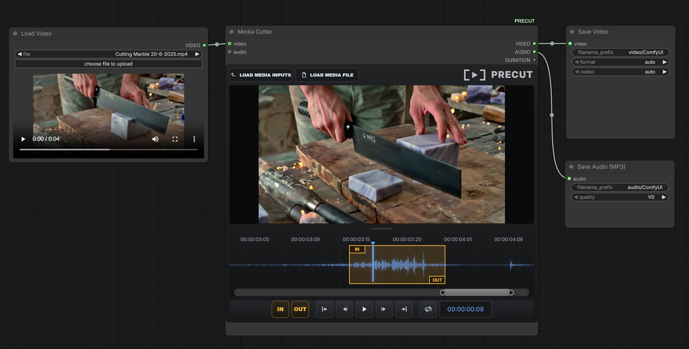
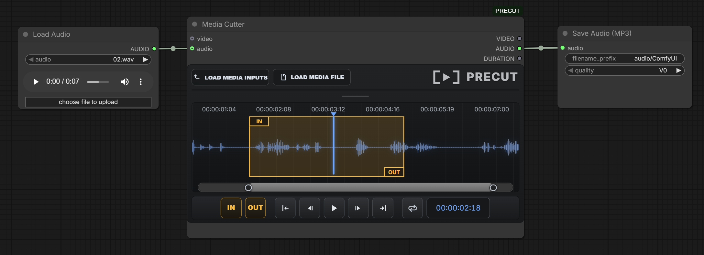

# PRECUT

PRECUT is a ComfyUI custom node pack for media editing utilities.

The first node in the pack is **Media Cutter**: a visual video/audio trimmer with an interactive timeline, waveform, IN/OUT markers, playback controls, and separate `VIDEO`, `AUDIO`, and `DURATION` outputs.

## Media Cutter

### Video workflow

### Audio workflow

## What It Does

- Loads video or audio from a connected ComfyUI input node.
- Loads video or audio directly from disk into `ComfyUI/input/PRECUT/`.
- Shows a visual timeline with waveform, timecodes, playhead, and draggable IN/OUT selection.
- Trims connected `VIDEO` inputs and returns the trimmed video plus extracted audio.
- Trims connected `AUDIO` inputs and returns the selected audio range.
- Trims loaded media files and returns `VIDEO`, `AUDIO`, and the selected duration in seconds.
- Supports resizing the node and timeline without pushing the controls out of place.
- Keeps the node display name as **Media Cutter** under the `PRECUT` category.

## Inputs

- `video` optional `VIDEO`: connect a ComfyUI video source.
- `audio` optional `AUDIO`: connect a ComfyUI audio source.

Connect either `video` or `audio`, not both, when using connected media inputs.

## Outputs

- `VIDEO`: the selected video range, or `None` for audio-only media.
- `AUDIO`: the selected audio range.
- `DURATION`: selected IN-to-OUT duration as a float in seconds.

## Controls

- `LOAD MEDIA INPUTS`: load the connected `VIDEO` or `AUDIO` input into the timeline.
- `LOAD MEDIA FILE`: upload a local media file into `ComfyUI/input/PRECUT/`.
- `IN` / `OUT` buttons: set the selection markers at the current playhead.
- Drag the yellow IN/OUT handles to adjust the cut range.
- Drag inside the selected range to move the whole range.
- Drag the blue playhead or click the timeline to seek.
- Mouse wheel over the timeline: zoom in or out around the playhead.
- Double-click the grey navigator bar: reset to full timeline view; double-click again to restore the previous zoom.
- Drag the grey navigator window or its side handles to pan/adjust the visible timeline range.
- Space: play/stop.
- Left / Right arrows: previous/next frame.
- Up arrow: go to IN.
- Down arrow: go to OUT.
- Loop button: loop playback from IN to OUT.

## Notes

- The internal legacy node id remains `PRECUT` for workflow compatibility, but the node is displayed as **Media Cutter**.
- FFmpeg is required for media probing, waveform generation, and audio extraction. PRECUT uses `imageio-ffmpeg`, PATH FFmpeg, or `PRECUT_FFMPEG_PATH` / `VHS_FORCE_FFMPEG_PATH` when available.
- Uploaded and registered media files are resolved through ComfyUI's input directory.
